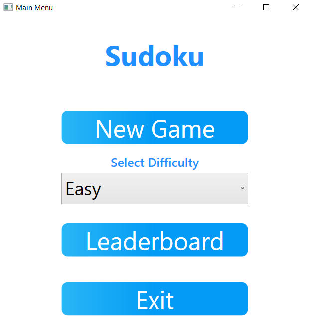
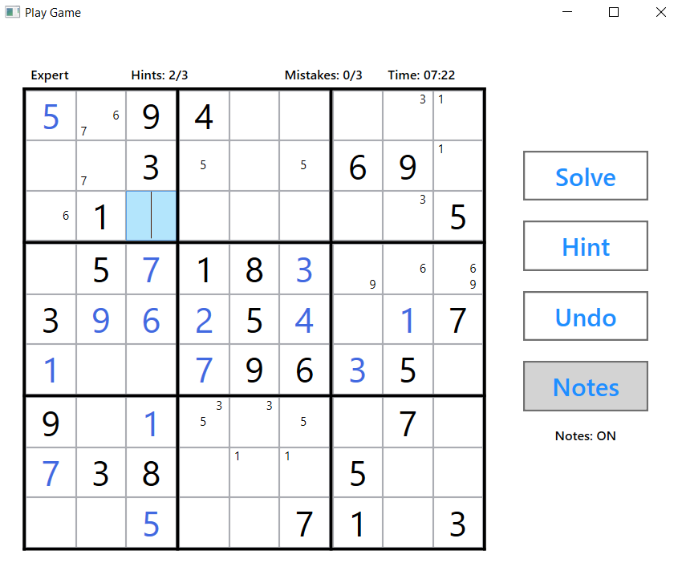
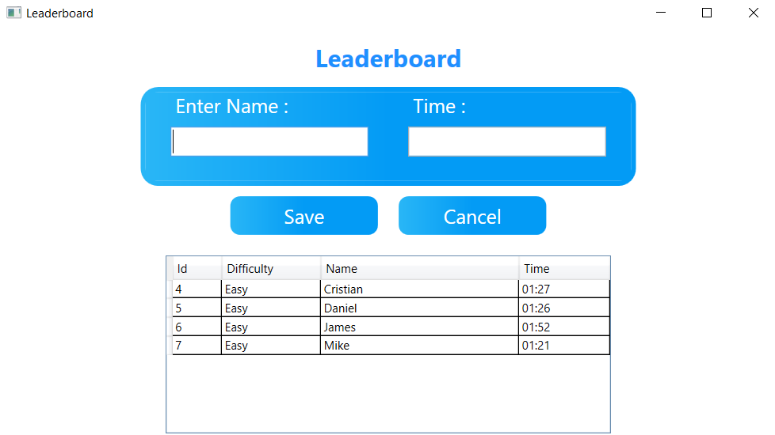

# Sudoku Application

  A sudoku application that was build on Windows Presentation Foundation (WPF) using C# and MS SQL Server.

  In the main menu, the user is allowed to start a new game by first choosing the difficulty level then clicking the "New Game" button. The user can also look at the      leaderboards menu to see what the rankings of other players are for each difficulty level. If the user no longer wants to play the game, the "Exit" button will close    the application.

  

  When the user chooses their level of difficulty and hits "New Game", the sudoku game will begin. This window will display the difficulty the user chose, number of hints remaining, number of mistakes made, and a time display to show how long they have spent trying to solve the puzzle. When it comes to solving complex sudoku puzzles, it will benefit users to have hints so they're encouraged to continue going and not give up. Complex sudoku puzzles also require logic-based thinking and having notes made available to users will allow them to pencil mark numbers into each box. If the user decides to give up, they have the option of clicking the "Solve" button which will display all the answers to the puzzle.

  

  If the user was able to complete the puzzle, they will be directed to the leaderboard menu where they can save their scores that displays how long it took them to solve the puzzle for the difficulty level they chose.

  

